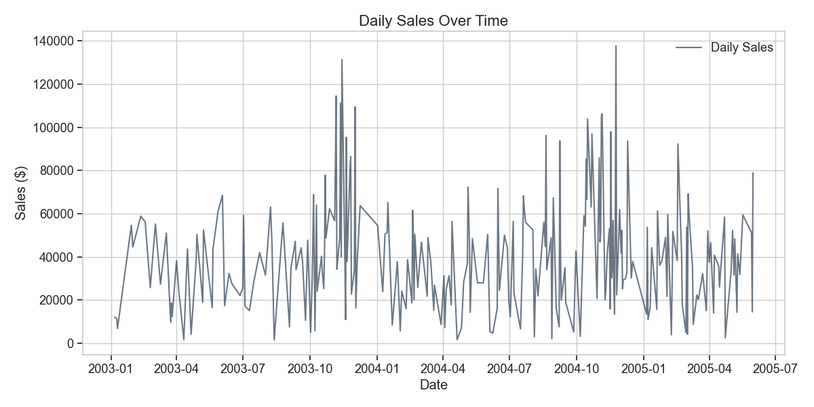
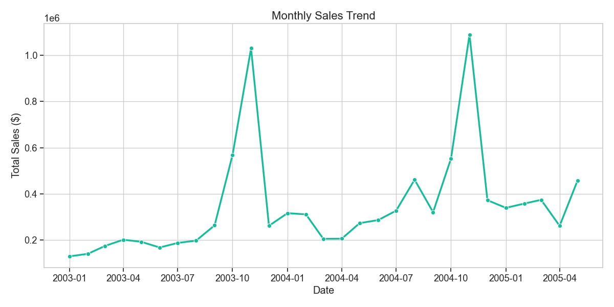
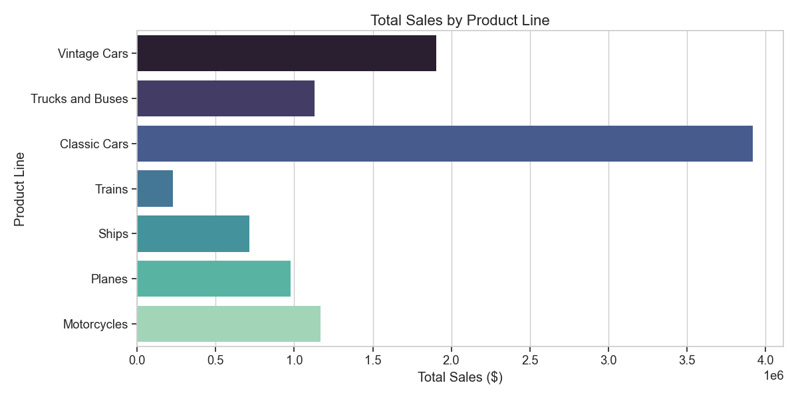
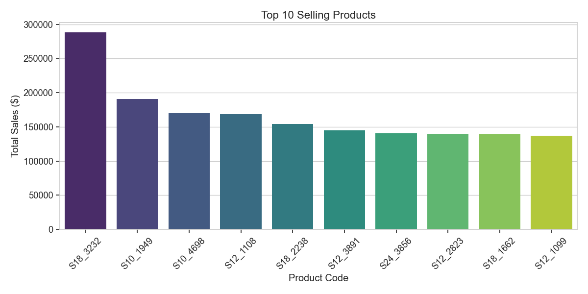
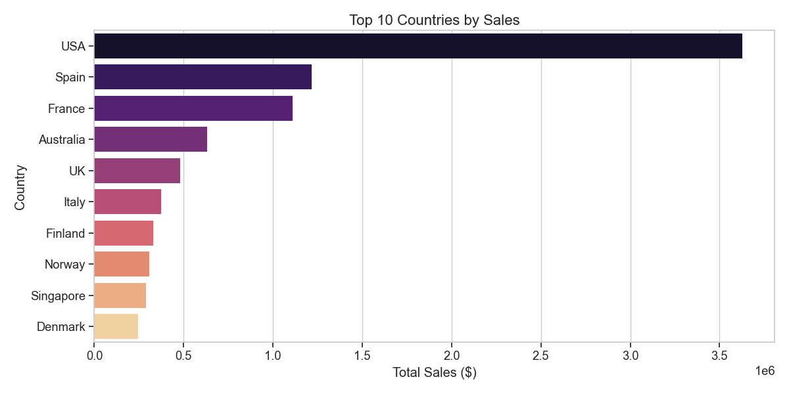
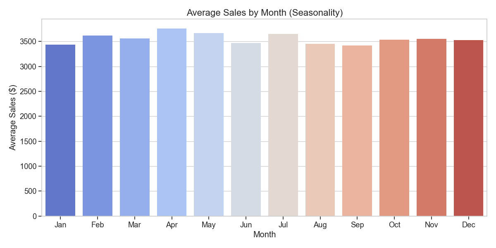
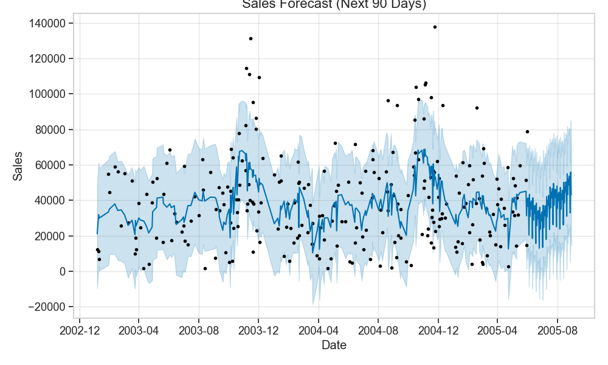

# Sales Analysis Report

## Executive Summary
This report presents a comprehensive analysis of retail sales data, including historical trends, product performance, and future forecasts. The analysis leverages **Facebook Prophet** for time series modeling to predict sales for the next 90 days.

**Key Highlights:**
-   **Total Revenue**: ~$10.03 Million
-   **Top Market**: USA
-   **Best Performing Category**: Classic Cars
-   **Peak Season**: April (Highest average sales)

---

## 1. Historical Sales Trends
### Daily Sales Overview
The daily sales chart reveals the overall trajectory of the business. We observe significant volatility with distinct spikes, likely corresponding to high-volume transaction days or seasonal events.

### Monthly Growth
Aggregating data by month shows a clearer trend. The business has experienced periods of growth followed by stabilization.

---

## 2. Product Performance
### Top Product Lines
**Classic Cars** are the dominant revenue driver, significantly outperforming other categories. Vintage Cars and Motorcycles follow, indicating a strong market preference for automotive collectibles.

### Top 10 Selling Products
The individual top-selling items align with the category trends. Focusing inventory and marketing on these high-value SKUs is recommended.

---

## 3. Regional Analysis
### Top Markets
The **USA** is by far the largest market, contributing the majority of sales. EMEA countries (Spain, France) also show strong performance, suggesting opportunities for localized marketing campaigns in these regions.

---

## 4. Seasonality & Timing
### Monthly Seasonality
**April** emerges as the strongest month on average, followed by November (likely due to holiday shopping). This insight is critical for inventory planning—stock levels should be maximized leading into Q2 and Q4.

### Weekly Patterns
Sales show a distinct weekly pattern. Understanding which days drive the most revenue can help in staffing and daily promotional timing.

---

## 5. Future Forecast (Next 90 Days)
### Sales Prediction
The Prophet model predicts the sales trend for the upcoming quarter. The forecast indicates the expected range of sales, helping stakeholders set realistic revenue targets.

### Trend Component
The underlying trend component extracted from the model shows the long-term direction of sales, filtering out noise and seasonality.

---

## Conclusion & Recommendations
1.  **Inventory Management**: Increase stock for **Classic Cars** and top-selling SKUs prior to **April** and **November**.
2.  **Market Focus**: Continue to nurture the **USA** market while exploring growth strategies in **Spain** and **France**.
3.  **Marketing**: Align promotional calendars with the identified monthly peaks to maximize conversion during high-intent periods.
